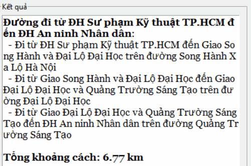
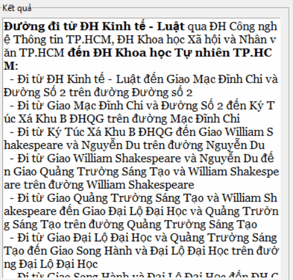
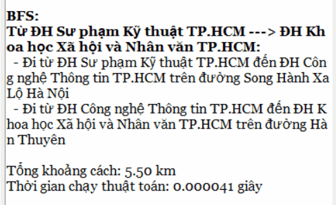
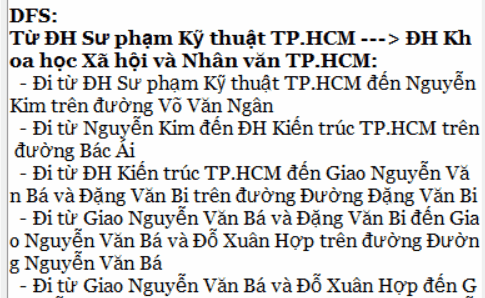
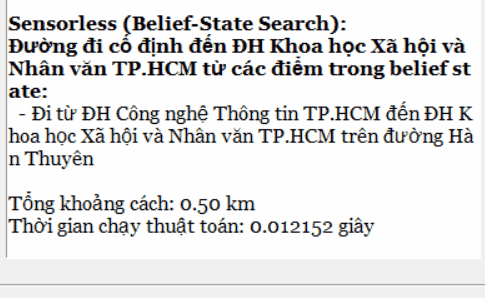
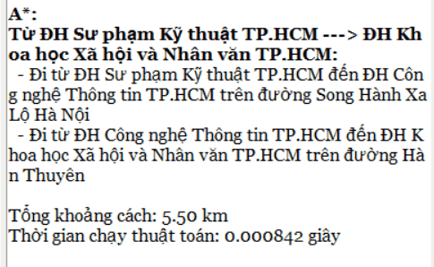
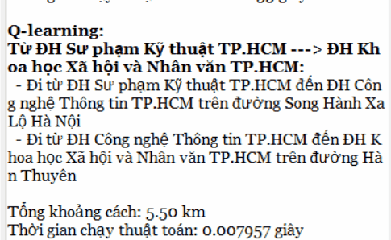
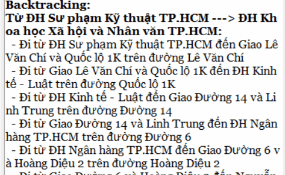
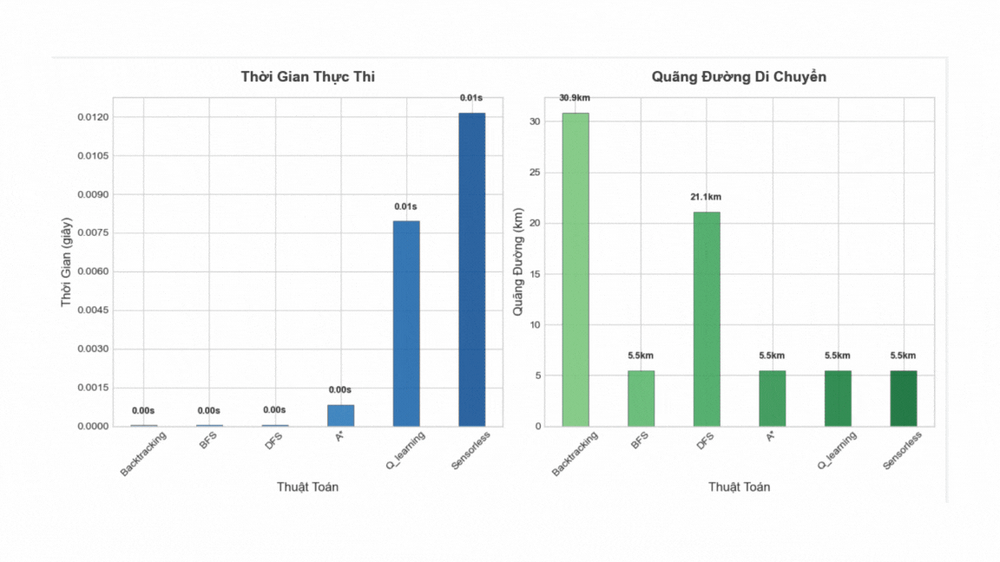

# 🧭 Đồ Án: Gợi Ý Đường Đi Thông Minh Giữa Các Trường Đại Học - Khu Vực Thủ Đức (TP.HCM)

## 👨‍💻 Thành viên nhóm
- **Lê Vũ Hải** [@Lvhai2k5](https://github.com/Lvhai2k5)  
- **Bùi Quốc Hậu** [@WuHou11](https://github.com/WuHou11)  
- **Nguyễn Thành Tài** [@nthanhtai-005](https://github.com/nthanhtai-005)

---
## Video demo

---

## 🎯 Giới thiệu

Ứng dụng gợi ý đường đi thông minh giữa các **trường đại học tại Thủ Đức - TP.HCM**, dựa trên nhiều thuật toán tìm kiếm và học máy.  
Hệ thống hỗ trợ người dùng lựa chọn điểm đi, điểm đến hoặc nhiều điểm trung gian để tìm tuyến đường phù hợp nhất.

---

## 🧪 Các thuật toán được tích hợp:

- 🟢 **UCS (Uniform Cost Search)**  
- 🔵 **A\* (A-Star Search)**  
- 🟡 **BFS (Breadth-First Search)**  
- 🔴 **DFS (Depth-First Search)**  
- 🟣 **Backtracking**  
- 🧬 **Genetic Algorithm**  
- 🧠 **Q-Learning**  
- 🕵️ **Sensorless (Không cảm biến - môi trường quan sát hạn chế)**

---

## 🗂️ Hướng dẫn sử dụng

### 🔹 Tab 1: UCS - Tìm đường ngắn nhất
- **Chức năng**: Tìm đường tối ưu giữa **một điểm bắt đầu và một điểm kết thúc**.
- **Cách dùng**: Chọn điểm xuất phát và điểm đến từ danh sách. Hệ thống sẽ hiển thị tuyến đường ngắn nhất dựa trên chi phí (thời gian/khoảng cách).

---

### 🔹 Tab 2: Genetic Algorithm - Đi qua nhiều trường
- **Chức năng**: Giải bài toán qua nhiều trường (TSP).
- **Cách dùng**: Chọn các điểm trung gian bạn muốn đi qua. Thuật toán sẽ tối ưu thứ tự di chuyển.

---

### 🔹 Tab 3: Các thuật toán khác - Mô phỏng đường đi
- **Bao gồm**: BFS, DFS, A*, Backtracking, Q-Learning, Sensorless.
- **Chức năng**: Mô phỏng đường đi theo các thuật toán khác nhau.
- **Cách dùng**: Chọn thuật toán mong muốn, hệ thống sẽ sinh ngẫu nhiên tuyến đường theo logic của thuật toán đó.

---

## 📌 Kết quả hiển thị

- Đường đi trực quan trên bản đồ **khu vực Thủ Đức**.
- Thông tin về **khoảng cách** và **thời gian di chuyển**.
- So sánh hiệu quả giữa các thuật toán dựa trên kết quả đầu ra.

---

## 🛠️ Công nghệ sử dụng

- Ngôn ngữ: `Python`
- Thư viện: `pygame`, `networkx`, `matplotlib`, `numpy`, `random`, ...
- Thuật toán tự xây dựng hoặc tinh chỉnh dựa trên nền tảng học thuật.

---

## 🚀 Hướng phát triển

- Tích hợp bản đồ thực tế (Google Maps, OpenStreetMap).
- Hỗ trợ điều kiện giao thông thực (thời gian, ùn tắc).
- Nâng cấp giao diện: Web App / Mobile App.

---

## 📬 Liên hệ & Đóng góp

Mọi đóng góp về thuật toán, UI/UX hoặc hiệu năng đều được hoan nghênh!  
Vui lòng tạo issue hoặc pull request tại repo GitHub để thảo luận thêm ❤️

---

